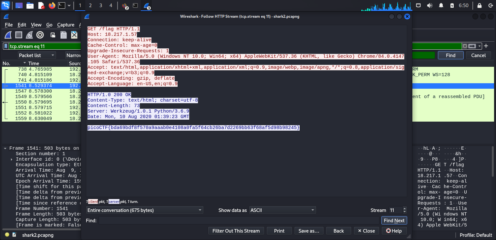

### Description
Can you find the flag? shark2.pcapng.
- hint 1: Did you really find _the_ flag?
- hint 2: Look for traffic that seems suspicious.

### Related term

DNS Exfiltration, tshark, and Base64 Decoding: An Overview

**1. What is DNS Exfiltration?**

DNS Exfiltration is a technique used by attackers to stealthily exfiltrate data from an internal network. Rather than sending data over traditional channels like HTTP or FTP, attackers "hide" data within DNS (Domain Name System) requests, a protocol used to translate domain names into IP addresses.

**2. Why DNS?**

- Ubiquity: DNS is a ubiquitous protocol on the internet, making its use for data exfiltration less noticeable.
- Small packet size: DNS packets are generally small, allowing them to blend in with other network traffic.
- Multiple DNS servers: The existence of many DNS servers provides attackers with multiple options to send data.

**3. The Role of tshark**

- Packet analysis: tshark is a powerful tool for capturing and analyzing network packets. It allows you to filter DNS packets, examine their contents, and look for signs of DNS exfiltration.
- Packet filtering: You can use tshark to filter DNS packets based on criteria such as domain name, IP address, and query type (A, AAAA, CNAME, TXT, etc.).
- Data display: tshark can display data within DNS packets in hex, ASCII, or other formats, aiding in analysis.

**4. Base64 Decoding**

- Data encoding: Base64 is a method of encoding binary data into a sequence of printable ASCII characters.
- Data obfuscation: Attackers often use Base64 to encode data before sending it over DNS, making the data less readable.
- Decoding: To recover the original data, you need to use a Base64 decoder.
- Parsing the string "fQ=="
- Base64 signature: The string "fQ==" has the specifications of a padded Base64 string. The "=" sign is often added to the last string to ensure the length of the string is a multiple of 4.
- Original data: To understand the exact meaning of "fQ==", we need to decode it back to the original data. However, it is not possible to decode correctly without knowing the original data type.

**5. How DNS Exfiltration Works**

- Data collection: The attacker collects the data to be exfiltrated.
- Encoding: The data is encoded using Base64 to obfuscate it.
- Segmentation: The data is divided into smaller segments to easily embed within DNS requests.
- Sending over DNS: The data segments are sent within DNS requests, typically in the domain name portion.
- Collection and decoding: The attacker on the external network collects the DNS packets and decodes the data to recover the original information.

### Approach 
- dựa theo hint một thì ta thấy sẽ có một cái flag để đánh lừa chúng ta
- theo hint hai gợi ý chúng ta tập trung vào những gói tin đang bị quá tải
**LET START !!!**

**STEP 1**
- chúng ta sẽ mở gói tin bằng wire shark để kiếm tra 
- thông thường ta sẽ kiểm tra bằng công cụ lọc trước để xem có kiểm được flag không thông qua hai key word "pico" và "flag", thì ở đây sau khi lọc bằng từ khóa flag thì ta thấy được một gói tin HTTP như sau:


- để xem được application data ở gói tin này thì ta chuột phải vào gói tin đó > follow > HTTP stream


như ta thấy ở hình trên thì đây chính là cái flag fake mà ta cần lưu ý.

**STEP 2**

- tiếp theo ta sẽ chú ý đến hint thứ 2, ở đây ta thấy có rất nhiều gói tin DNS đều có nội dung là "reddshrim..." thì có khả năng đây sẽ là các gói tin bị quá tải mà hint nói đến
- okay bh ta sẽ dùng lệnh sau để lọc đi các gói tin khác và chỉ lấy các gói tin DNS từ địa chỉ ip 192.168.38.104 
```
tshark -nr shark2.pcapng -Y'dns' | grep -v '8.8.8.8'
```
tshark -nr shark2.pcapng:

tshark: Đây là một công cụ dòng lệnh mạnh mẽ được sử dụng để bắt và phân tích các gói tin mạng.
- "-nr": Tùy chọn này yêu cầu tshark đọc một tệp bắt gói có tên là shark2.pcapng. Phần mở rộng .pcapng cho biết đây là một tệp bắt gói ở định dạng mới hơn, cung cấp nhiều thông tin chi tiết hơn so với định dạng PCAP cũ.
- "-Y'dns'": Tùy chọn này được sử dụng để lọc các gói tin. Cụ thể, nó sẽ chỉ hiển thị các gói tin có liên quan đến DNS (Domain Name System).
- "|": Ký tự pipe (|) này có nghĩa là kết quả đầu ra của lệnh bên trái (tshark) sẽ được truyền làm đầu vào cho lệnh bên phải (grep).
grep -v '8.8.8.8':
grep: Đây là một công cụ tìm kiếm văn bản trong các file.
- "-v": Tùy chọn này đảo ngược kết quả tìm kiếm, nghĩa là grep sẽ in ra các dòng không chứa mẫu tìm kiếm.
'8.8.8.8': Đây là mẫu tìm kiếm. grep sẽ tìm kiếm các dòng có chứa chuỗi "8.8.8.8".

**STEP 3**

vì hint ở đây là các gói tin dns bị quá tải nên sẽ là các query được gửi lên server bị quá tải vậy nên ta cần lọc bớt các dns response bằng cách thêm lệnh "grep -v response" ở phía sau và ta có:
```
tshark -nr shark2.pcapng -Y'dns' | grep -v '8.8.8.8' | grep -v response
```

***sau khi dùng lệnh bên trên***

**STEP 4**
Ở bước này ta chỉ cần lọc ra để chọn những querry từ local bằng lệnh sau:
```
tshark -nr shark2.pcapng -Y'dns' | grep -v '8.8.8.8' | grep -v response | grep local
```


***sau khi lọc lấy local***

**STEP5**

Ở hình bên trên ta thấy được có hai gói DNS có ký hiệu "FQ==", thì đâu chính là dấu hiệu của mã hóa base 64 việc ta cần làm bh là đưa nó về dữ liệu gốc bằng lệnh

```
tshark -nr shark2.pcapng -Y'dns' | grep -v '8.8.8.8' | grep -v response | grep local | awk -e '{print $12}' | sed -e 's/\..*//' | base64 -d
```

- awk -e '{print $12}': Sử dụng awk để in ra cột thứ 12 của mỗi dòng. Trong trường hợp này, có thể là phần chứa thông tin cần thiết.
- sed -e 's/\..*//': Sử dụng sed để loại bỏ mọi ký tự từ dấu chấm đầu tiên trở đi trong mỗi dòng, có thể để lấy ra một phần thông tin cụ thể.
- base64 -d: Giải mã dữ liệu được mã hóa Base64.

### Solutioin
```
picoCTF{dns_3xf1l_ftw_deadbeef}
```

